# [🗺️ Papermap](https://papermap.org/)


<br/>

This project is a collaborative website that provides an overview of scientific literature findings on a wide range of questions by collecting and sorting scientific papers using simple heuristics.

You can access the website at **[papermap.org](https://papermap.org/)**.

<br/>

<p align="center">
	
</p>

<br/>

## 📋 Summary

* **[📋 Summary](#-summary)**
* **[🤝 Contribute](#-contribute)**
* **[✨ Features](#-features)**
	* [🏠 Home](#-home)
	* [📖 Maps](#-maps)
	* [🗺️ Map](#-map)
	* [💾 Download](#-download)
	* [📃 Paper](#-paper)
	* [📰 Journal](#-journal)
	* [✍️ Edit](#-edit)
	* [📊 Statistics](#-statistics)
* **[🛠️ Install](#%EF%B8%8F-install)**
	* [📦 Dependencies](#-dependencies)
	* [🚀 Run](#-run)
* **[🙏 Credits](#-credits)**

<br/>

## 🤝 Contribute

Anyone can contribute to this project, even if you're not a developer! You can join the [**Discord server**](https://discord.gg/eFdjRJe7WZ) or read the [**contribution guide**](/doc/contribute) to learn how to contribute.

<br/>

## ✨ Features

### 🏠 Home

The home page displays a search bar where you can search for a question, a button to get the list of all maps, a button to be redirected to a random map, and a button to see statistics about the data collected so far:

<p align="center">
	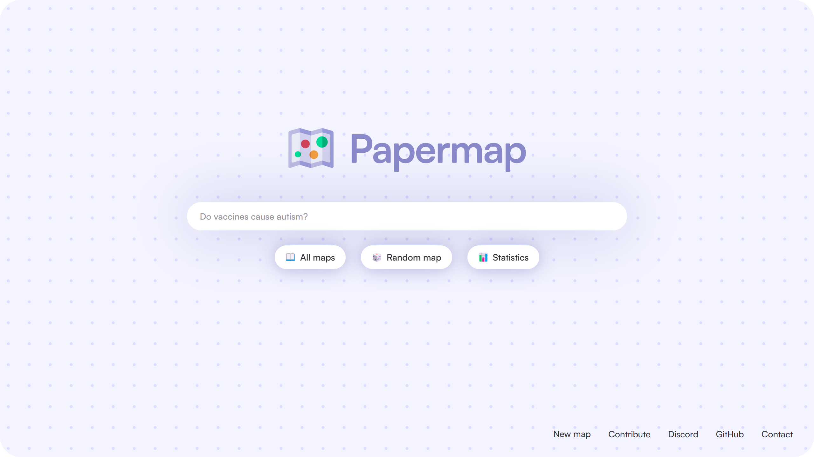
</p>

There are also some links at the bottom of the page, with one ("New map") opening a form to submit a new map:

<p align="center">
	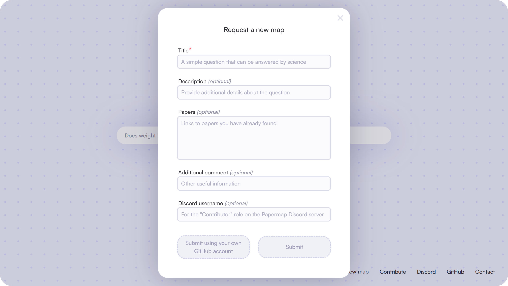
</p>

### 📖 Maps

The maps page displays the list of all maps currently available on **Papermap**:

<p align="center">
	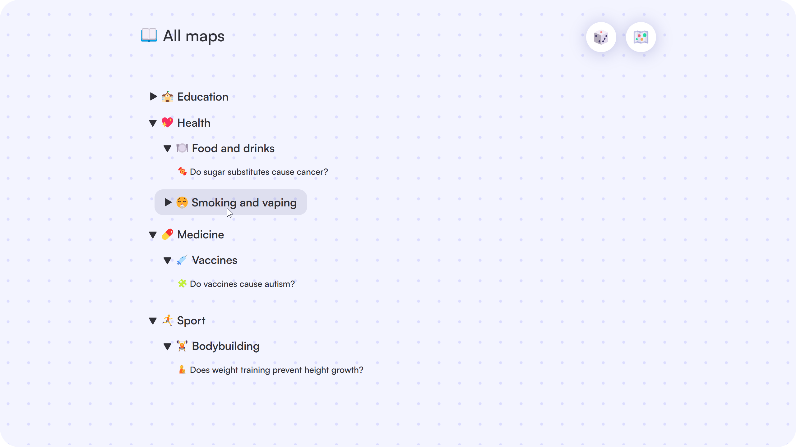
</p>

### 🗺️ Map

Each question has a dedicated page that displays a map of scientific papers related to that question. The x-axis represents the year of publication, while the y-axis represents the score of the paper (see [how the score is calculated](/doc/scoring/papers.md)). The size of the dots corresponds to the number of reviewed papers for literature reviews (non-reviews have the smallest size), and the color indicates their conclusion as shown in the top summary bar:

<p align="center">
	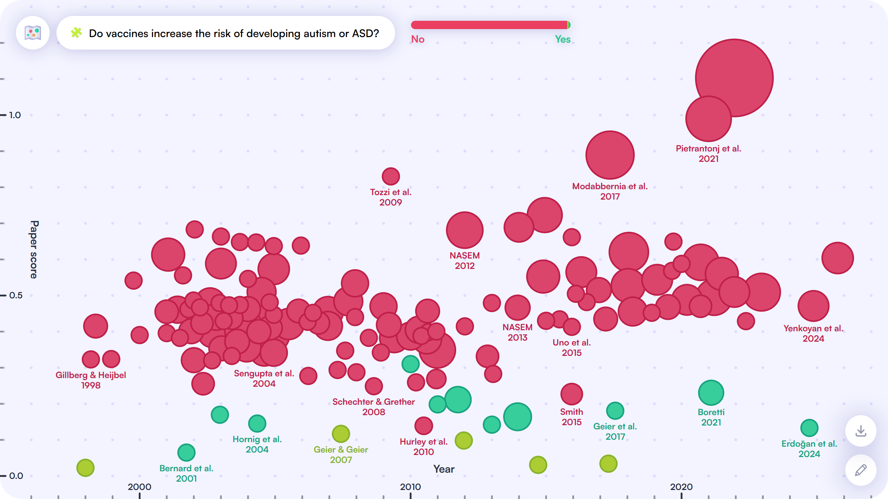
</p>

Hovering a part of the top summary bar highlights the corresponding papers on the map:

<p align="center">
	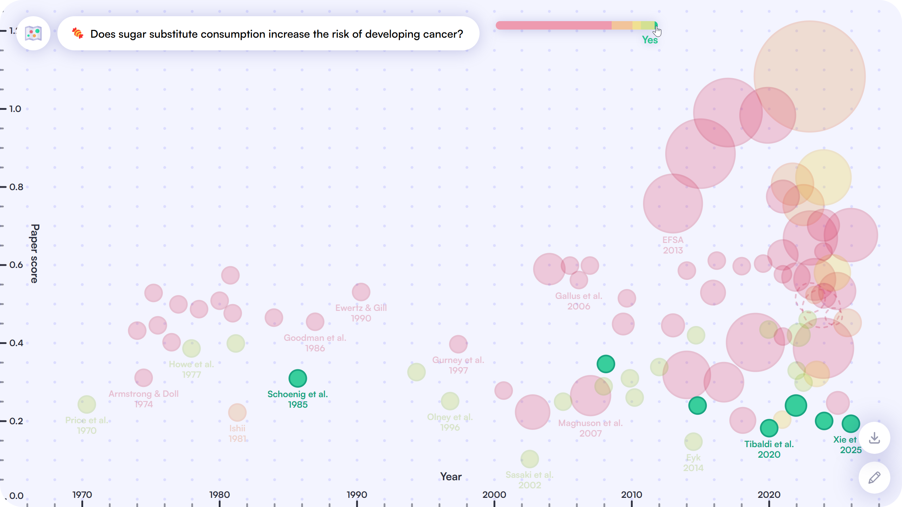
</p>

### 💾 Download

At the bottom right of each map page, you can find a download button that allows you to download the map as a PNG image or an SVG vector file, as well as the data used to create the map in CSV format. There is also a button to copy a text version of the map to your clipboard:

<p align="center">
	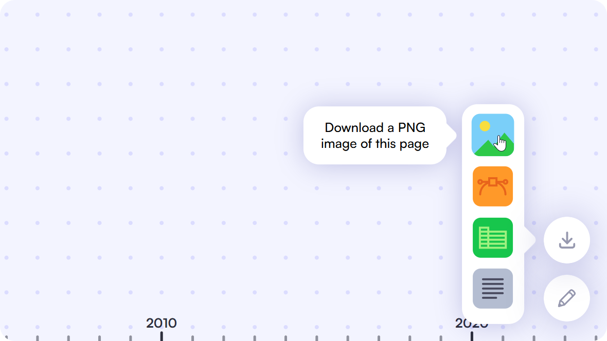
</p>

### 📃 Paper

When hovering a dot on the map, a tooltip appears with the title of the paper, its authors, the year of publication, the previous consensus according to the paper, the conclusion of the paper with a quote that supports it, and all the information used to calculate the score of the paper:

<p align="center">
	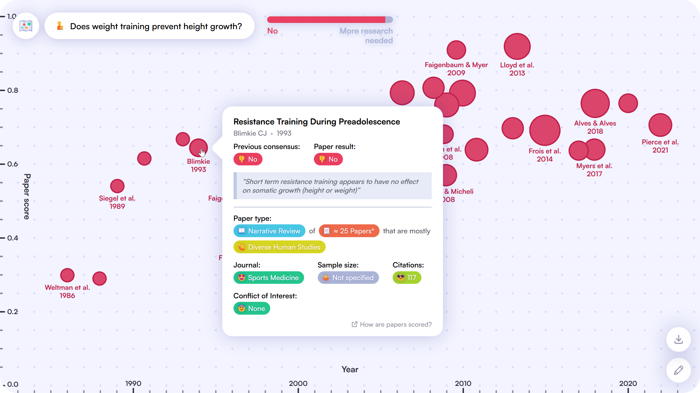
</p>

### 📰 Journal

On the paper tooltip, when hovering over the journal, another tooltip appears with the title of the journal, its publisher, and all the information used to calculate the score of the journal:

<p align="center">
	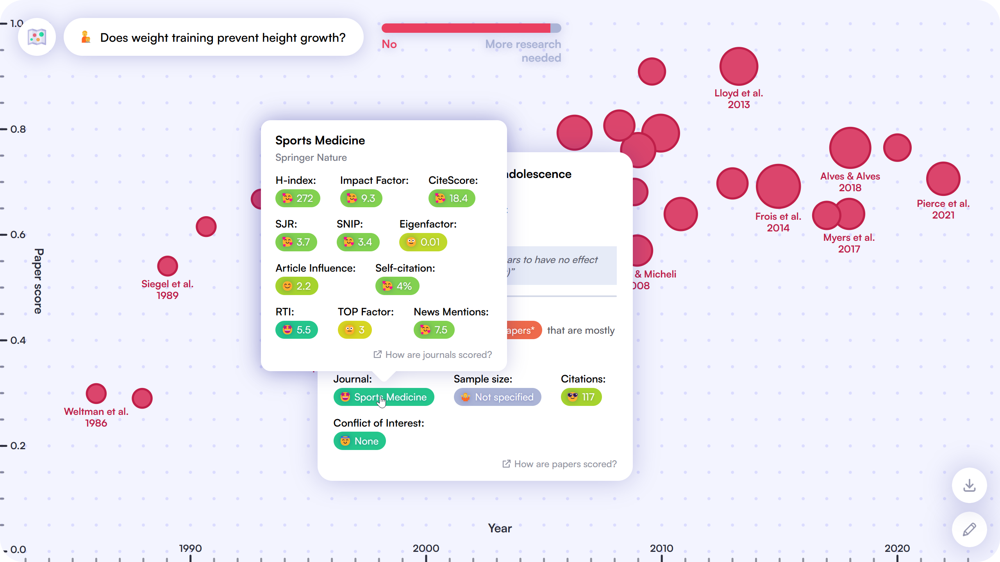
</p>

### ✍️ Edit

At the bottom right of each map page, you can find an edit button that enables the edit mode, allowing you to delete, modify, or add papers to the map:

<p align="center">
	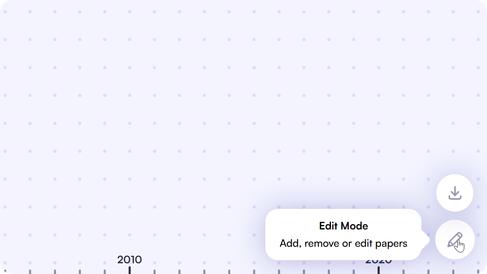
</p>

Editing a paper opens a form containing all the information about the paper that you can modify:

<p align="center">
	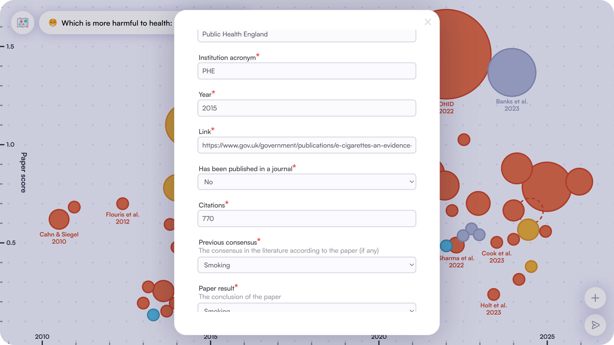
</p>

Adding a paper (by clicking the `➕` button at the bottom right of the map) first opens a search bar where you can search for the paper (to auto-fill some fields):

<p align="center">
	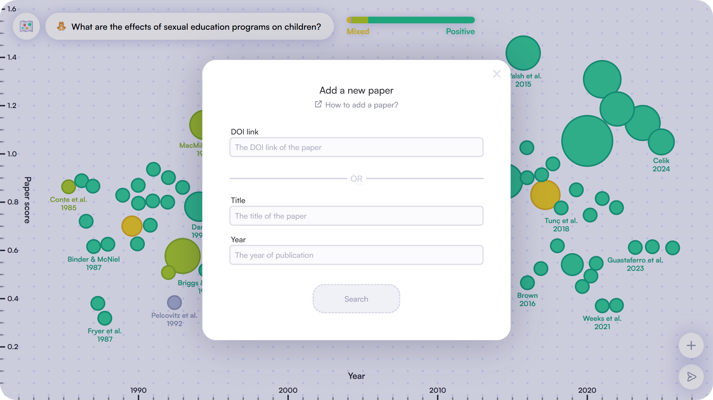
</p>

Clicking on the `➤` button at the bottom right of the map opens a form to fill in before submitting your changes:

<p align="center">
	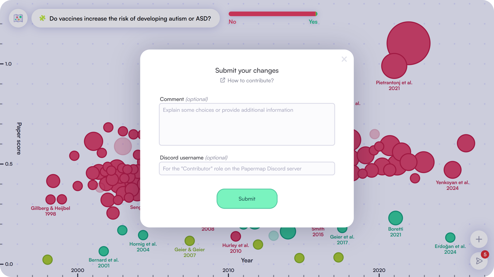
</p>

### 📊 Statistics

The statistics page displays some statistics about the data collected so far on **Papermap**, mainly focused on paper scores in order to use it as a basis for future updates of the scoring algorithm:

<p align="center">
	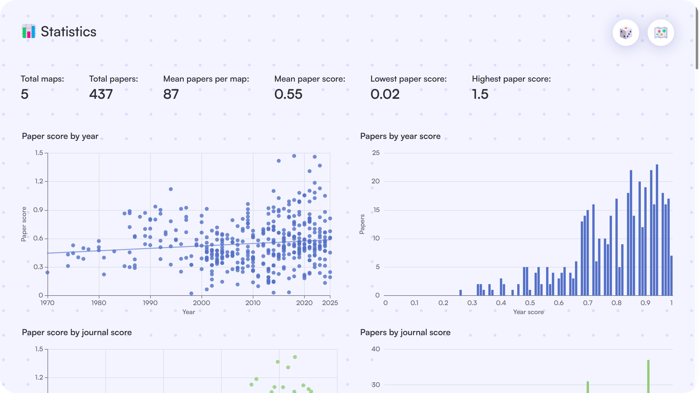
</p>

## 🛠️ Install

### 📦 Dependencies

You first need to install **[Node.js](https://nodejs.org/)** on your computer, then you can install the dependencies by running the following command in the root folder of the project:

```console
$ npm install
```

### 🚀 Run

To run the project locally, you can use the following command:

```console
$ npm run dev
```

This will start a local development server and you can access the website at **[http://localhost:5173](http://localhost:5173)**.

If you have **[Docker](https://www.docker.com/)** installed, you can also run the project in a production environment by using the following command:

```console
$ npm run deploy
```

This will build the project and start a production server in a Docker container, you can then access the website at **[http://localhost](http://localhost)**.

<br/>

## 🙏 Credits

* [**Angel Uriot**](https://github.com/angeluriot): creator of the project.
