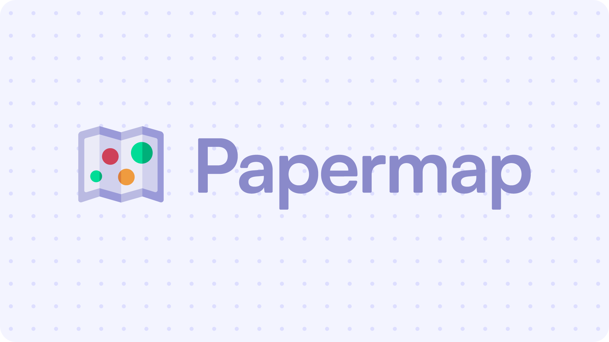

# [🗺️ Papermap](https://papermap.org/)


<br/>

This project is a collaborative website that provides an overview of scientific literature findings on a wide range of questions by collecting and sorting papers using simple heuristics.

You can access the website at **[papermap.org](https://papermap.org/)**.

<br/>

<p align="center">
	
</p>

<br/>

# 📋 Summary

* **[📋 Summary](#-summary)**
* **[🤝 Contribute](#-contribute)**
* **[✨ Features](#-features)**
	* [🏠 Home](#-home)
	* [🗺️ Map](#-map)
	* [📄 Paper](#-paper)
	* [📰 Journal](#-journal)
	* [💾 Download](#-download)
	* [✍️ Edit](#-edit)
* **[🛠️ Install](#%EF%B8%8F-install)**
	* [📦 Dependencies](#-dependencies)
	* [🚀 Run](#-run)
* **[🙏 Credits](#-credits)**

<br/>

# 🤝 Contribute

Anyone can contribute to this project, even if you are not a developer! You can join the [**Discord server**](https://discord.gg/eFdjRJe7WZ) or read the [**contribution guide**](https://github.com/yourusername/yourrepository/blob/main/CONTRIBUTING.md) to learn how to contribute.

<br/>

# ✨ Features

TODO

<br/>

## 🏠 Home

TODO

<br/>

## 🗺️ Map

TODO

<br/>

## 📄 Paper

TODO

<br/>

## 📰 Journal

TODO

<br/>

## 💾 Download

TODO

<br/>

## ✍️ Edit

TODO

<br/>

# 🛠️ Install

## 📦 Dependencies

You first need to install **[Node.js](https://nodejs.org/)** on your computer, then you can install the dependencies of the project by running the following command in the root folder of the project:

```console
$ npm install
```

<br/>

## 🚀 Run

To run the project locally, you can use the following command:

```console
$ npm run dev
```

This will start a local development server and you can access the website at **[http://localhost:5173](http://localhost:5173)**.

If you have **[Docker](https://www.docker.com/)** installed, you can also run the project in a production environment by using the following command:

```console
$ npm run deploy
```

This will build the project and start a production server, you can then access the website at **[http://localhost](http://localhost)**.

<br/>

# 🙏 Credits

* [**Angel Uriot**](https://github.com/angeluriot) : Creator of the project.
